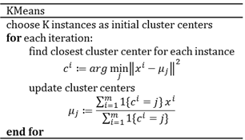
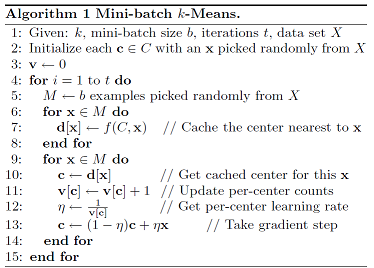
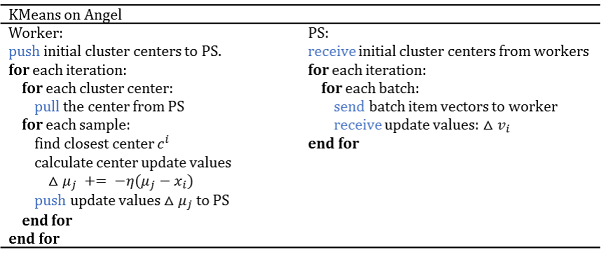

# KMeans

> KMeans是一种简单的聚类算法，将数据集划分为多个簇，K为簇的个数。传统的KMeans算法，有一定的性能瓶颈，通过PS实现的KMeans，在准确率一致的情况下，性能更佳。

## 1. 算法介绍

每个样本被划分到距离最近的簇。每个簇所有样本的几何中心为这个簇的簇心，样本到簇心的距离为样本到簇的距离。Kmeans算法一般以迭代的方式训练，如下所示：

其中：x_i代表第i个样本，c_i代表与第i个样本距离最近的簇，代表第j个簇的簇心。

## Mini-batch KMeans
"Web-Scale K-Means Clustering"提出一种在朴素KMeans算法基础上改进的KMeans算法，用mini-batch方法训练，每次迭代选择一个mini-batch的样本更新簇心，如下所示：

## 2. 分布式实现 on Angel

### 模型存储
Angel实现的KMeans算法将K个簇心存储在ParameterServer上，用一个K×N维的矩阵表示，其中：K为簇心的个数，N为数据的维度，即特征的个数。

### 模型更新
KMeans on Angel以迭代的方式训练，每次训练以上文提到的mini-batch KMeans算法更新簇心。

### 算法逻辑
KMeans on Angel的算法流程如下图所示：

## 3. 运行 & 性能

### 输入格式

### 参数
* IO参数
  * angel.train.data.path：输入数据路径
  * ml.feature.num：数据特征个数
  * ml.data.type：数据格式，支持"dummy"、"libsvm"
  * angel.save.modelPath：训练完成后，模型的保存路径
  * angel.log.path：log文件保存路径
* 算法参数
  * ml.kmeans.center.num：K值，即簇的个数
  * ml.kmeans.sample.ratio.perbath：每次迭代选择mini-batch样本的采样率
  * ml.kmeans.c：学习速率参数

### 性能
