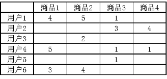
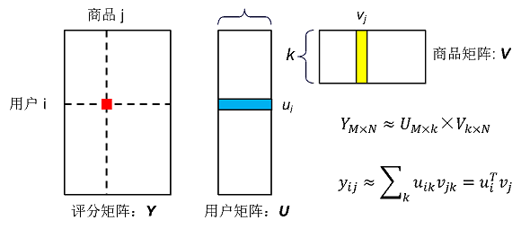
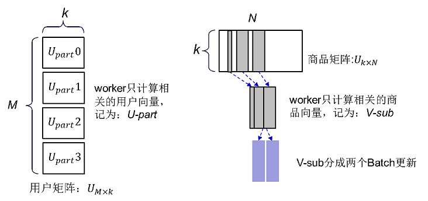
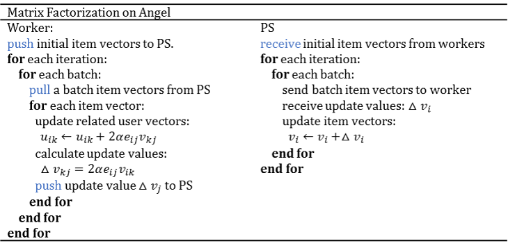

# Matrix Factorization

> Matrix Factorizaiton是推荐系统中常用的矩阵分解算法，将用户、商品抽象为K维向量，将用户-商品矩阵分解为用户矩阵和商品矩阵的乘积。


## 1. 算法介绍
MF的主要思想是把用户、商品的特征抽象为k维向量表示。  

用户-商品评分矩阵（简称评分矩阵），是推荐系统中常用的数据表示方法，用一个矩阵表示用户对商品的打分。矩阵的每行代表一个用户，每列代表一个商品，每个元素代表对应用户对商品的评分，如图一所示。在大多数情况下商品数量巨大，每个用户只对极小部分商品有评分，所以评分矩阵一般非常稀疏，即评分矩阵中的绝大多数元素为0。MF算法把评分矩阵分解为用户-特征矩阵（简称用户矩阵）和特征-商品矩阵（简称商品矩阵）。   
 



设数据集有M个用户，N个商品：评分矩阵用Y表示，Y的维度为：M×N，y_{ij} 表示第i个用户对第j个商品的评分；MF算法把评分矩阵Y分解为用户矩阵U和商品矩阵V的乘积，U的维度为M×k，每一行代表一个用户u_i，u_i是一个k维特征向量；V的维度为k×N，每一列代表一个商品v_j, v_j是一个k维特征向量；k是MF算法指定的值，代表特征向量的维度。我们以用户向量u_i和商品向量v_j的乘积作为用户i对商品j评分的预测值，记为y_{ij}，如图二所示：  




## Gradient Descent Matrix Factorizaion
用户i对商品j的实际评分为y_{ij}预测值与真实值之差记为e_{ij}，即：e_{ij}=y{ij}-u_i \cdot v_j。
MF算法的学习目标是最小化预测评分与真实评分之间的差距：


为了防止模型过拟合，加入L2正则项：


其中：     

用梯度下降法最小化目标函数，得到用户特征向量u_i、商品特征向量v_j的更新公式为：  

    


## 2. 分布式实现 on Angel
---
### 模型存储
* 商品矩阵存放在PS，用户矩阵存放在Worker，PS和Worker间传输商品矩阵V即可，不需要传输用户矩阵U。
* 由用户向量的更新公式可知，用户向量的计算只和这个用户的评分数据有关，用户间相互独立，因此我们把用户矩阵U按照用户切分成多个子块存储在多个Worker，每个Worker只计算自己训练数据相关的用户的向量，记为：U-part，维度是：这个Worker分配到的用户数×k。

### 模型计算
Angel用梯度下降法学习MF模型，为了减少计算量和网络通信、提高计算效率，对算法做了以下设计：

* 因为商品向量的计算只和对它的评分相关，Worker上的训练数据可能只包含商品集合中的一部分商品的评分信息，这个Worker只能计算出这部分商品向量的梯度值，对无评分的商品计算的梯度值永远等于0，所以每次迭代只从PS拉取有评分的商品的向量即可，是整个商品矩阵的一个子集，记为V-sub矩阵。

* 当商品数量很大且k是一个比较大的值时，V-sub矩阵仍然可能超过了单个Worker的内存，而商品向量之间的更新相互独立，所以我们设计分批更新V-sub矩阵。每次迭代分成多个批计算，每批只从PS获取V-sub的一部分，用这部分商品向量更新Worker的用户矩阵，计算这部分商品向量的更新值推送给PS。




### 算法逻辑

Matrix Factorization on Angel的算法逻辑如下所示：




## 3. 运行 & 性能

---

### 输入格式

MF训练数据的格式：

```
		用户ID，商品ID：评分，…，商品：评分
```

一个用户的所有评分存储在一行。

如下图所示：


* ID为0的用户对ID为1、66、99、1001的商品评分分别为4、2、4、1
* ID为1的用户对ID为77的商品评分为3。

### 参数
* IO参数
  * angel.train.data.path：输入数据路径
  * angel.save.modelPath：商品特征矩阵保存路径
  * angel.ml.mf.usermodel.output：用户特征矩阵保存路径
  * angel.log.path：LOG保存路径
* 算法参数
  * ml.mf.rank：用户、商品特征向量的维度
  * ml.mf.item.num：商品数量
  * ml.mf.lambda：正则化系数
  * ml.mf.eta：学习速率
  * ml.mf.row.batch.num：每次迭代的batch数


### 性能对比